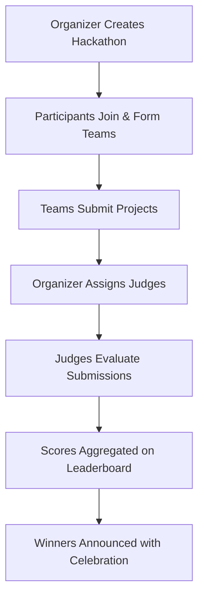
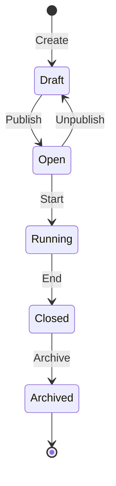

# Hackathon Judge - Complete Application Guide

> **Document Purpose:** A comprehensive, step-by-step guide for presenting the Hackathon Judge web application to stakeholders. This guide covers every feature, user role, page, and workflow in detail.

---

## Table of Contents

1. [Application Overview](#1-application-overview)
2. [User Roles & Permissions](#2-user-roles--permissions)
3. [Authentication System](#3-authentication-system)
4. [Dashboard Experience](#4-dashboard-experience)
5. [Hackathon Management](#5-hackathon-management)
6. [Team Management](#6-team-management)
7. [Submission System](#7-submission-system)
8. [Evaluation & Judging System](#8-evaluation--judging-system)
9. [Leaderboard & Results](#9-leaderboard--results)
10. [User Profiles](#10-user-profiles)
11. [Mobile Experience](#11-mobile-experience)
12. [Technical Architecture](#12-technical-architecture)
13. [Presentation Flow Recommendations](#13-presentation-flow-recommendations)

---

## 1. Application Overview

### What is Hackathon Judge?

**Hackathon Judge** is a comprehensive, full-stack web application designed to manage the complete lifecycle of hackathons — from creation and team registration to submission evaluation and winner announcement.

### Key Value Propositions

| Feature | Business Value |
|---------|---------------|
| **End-to-End Management** | A single platform for organizers, judges, and participants |
| **Role-Based Access** | Secure, role-specific features for each user type |
| **Automated Assignment** | Auto-assign judges to teams with balanced workload |
| **Transparent Scoring** | Weighted criteria-based evaluation system |
| **Real-time Leaderboard** | Live rankings with celebration animations for winners |
| **Mobile-First Design** | Responsive UI with bottom navigation for mobile devices |

### Core User Workflows



---

## 2. User Roles & Permissions

The application supports **4 distinct user roles**, each with specific capabilities and access levels.

### 2.1 Participant (Default Role)

The standard user role for hackathon attendees.

| Capability | Description |
|------------|-------------|
| **Browse Hackathons** | View all public hackathons with filtering options |
| **Join Teams** | Request to join existing teams or create new ones |
| **Create Teams** | Start a new team for a specific hackathon |
| **Submit Projects** | Create and edit project submissions |
| **View Leaderboard** | See rankings and scores after evaluation |
| **Manage Profile** | Update personal information and avatar |

**Dashboard Quick Actions:**
- Browse Hackathons
- My Teams
- My Submissions

---

### 2.2 Judge Role

Specialized role for evaluating hackathon submissions.

| Capability | Description |
|------------|-------------|
| **All Participant Features** | Full participant access |
| **My Evaluations** | Dashboard showing assigned hackathons |
| **Evaluate Submissions** | Score submissions using defined criteria |
| **View Submission Details** | Access full project information and assets |
| **Save Draft Scores** | Save partial evaluations to continue later |
| **Submit Final Scores** | Lock in scores for leaderboard calculation |

**Dashboard Quick Actions:**
- My Evaluations (highlighted)
- Browse Hackathons
- My Teams
- My Submissions

---

### 2.3 Organizer Role

For hackathon creators and managers.

| Capability | Description |
|------------|-------------|
| **All Participant Features** | Full participant access |
| **Create Hackathon** | Build new hackathon events |
| **Manage Hackathon Settings** | Edit details, dates, prizes, team constraints |
| **Define Evaluation Criteria** | Set custom scoring rubrics with weights |
| **Manage Judges** | Assign/remove judges from the hackathon |
| **Assignment Management** | Auto-assign or manually assign judges to teams |
| **View All Submissions** | Access all project submissions |
| **Control Status Lifecycle** | Transition hackathon: Draft → Open → Running → Closed → Archived |

**Dashboard Quick Actions:**
- Create Hackathon (highlighted)
- My Hackathons
- Browse Hackathons
- My Teams
- My Submissions

---

### 2.4 Admin Role

Full system administration privileges.

| Capability | Description |
|------------|-------------|
| **All Organizer Features** | Complete organizer access |
| **All Judge Features** | Complete judge access |
| **User Management** | Manage all users in the system |
| **Audit Logs** | View system activity logs |
| **Delete Hackathons** | Permanently remove hackathons |
| **Override Permissions** | Access all data regardless of ownership |

**Dashboard Quick Actions:**
Same as Organizer with additional admin navigation items.

---

### Role Comparison Matrix

| Feature | Participant | Judge | Organizer | Admin |
|---------|:-----------:|:-----:|:---------:|:-----:|
| Browse Hackathons | ✅ | ✅ | ✅ | ✅ |
| Join/Create Teams | ✅ | ✅ | ✅ | ✅ |
| Submit Projects | ✅ | ✅ | ✅ | ✅ |
| View Leaderboard | ✅ | ✅ | ✅ | ✅ |
| Evaluate Submissions | ❌ | ✅ | ❌ | ✅ |
| Create Hackathon | ❌ | ❌ | ✅ | ✅ |
| Manage Criteria | ❌ | ❌ | ✅ | ✅ |
| Assign Judges | ❌ | ❌ | ✅ | ✅ |
| User Management | ❌ | ❌ | ❌ | ✅ |
| View Archived Hackathons | ❌ | ✅ | ✅ | ✅ |

---

## 3. Authentication System

### 3.1 Login Page (`/login`)

**Route:** `/login`

**Features:**
- Email and password authentication
- Form validation with real-time error messages
- Password visibility toggle
- "Forgot Password" link
- Redirect to intended page after login
- Registration link for new users

**Validation Rules:**
- Email: Required, must be valid email format
- Password: Required, minimum 6 characters

**Demo Flow:**
1. Navigate to `/login`
2. Show email/password fields with validation
3. Demonstrate password visibility toggle
4. Show error handling for invalid credentials
5. Successful login redirects to Dashboard

---

### 3.2 Registration Page (`/register`)

**Route:** `/register`

**Features:**
- User registration with name, email, password
- Password strength indicator
- Confirm password matching
- Form validation
- Link to login for existing users

**Form Fields:**
| Field | Validation |
|-------|------------|
| Name | Required, 2-100 characters |
| Email | Required, valid email format |
| Password | Required, min 6 chars, uppercase, lowercase, number |
| Confirm Password | Must match password |

**Demo Flow:**
1. Show registration form with all fields
2. Fill in fields and show real-time validation
3. Demonstrate password strength indicator
4. Show password mismatch error
5. Complete registration → Auto-login → Dashboard

---

### 3.3 Forgot Password (`/forgot-password`)

**Route:** `/forgot-password`

**Features:**
- Email input for password reset request
- Sends reset link to email
- Confirmation message on success

---

### 3.4 Reset Password (`/reset-password`)

**Route:** `/reset-password`

**Features:**
- Token-based password reset
- New password with confirm
- Redirect to login on success

---

## 4. Dashboard Experience

### 4.1 Dashboard Page (`/dashboard`)

**Route:** `/dashboard`

**The dashboard is the central hub that adapts to user roles.**

### Key Visual Components

#### Welcome Section
- Personalized greeting: "Welcome back, [First Name]!"
- Subtitle: "Here's an overview of your hackathon activities."

#### Statistics Grid (4 Cards)
| Stat | Icon | Description |
|------|------|-------------|
| Hackathons | Trophy | Active hackathons count |
| Teams | Users | Number of user's teams |
| Submissions | FileText | Total submissions |
| Evaluations | BarChart3 | Pending reviews (for judges) |

#### Quick Actions Section
Role-specific action cards with icons and descriptions.

**Participant Actions:**
- Browse Hackathons
- My Teams  
- My Submissions

**Judge Actions:**
- My Evaluations (highlighted)
- Browse Hackathons
- My Teams
- My Submissions

**Organizer Actions:**
- Create Hackathon (highlighted)
- My Hackathons
- Browse Hackathons
- My Teams
- My Submissions

**Demo Flow:**
1. Login as Participant → Show basic quick actions
2. Login as Judge → Highlight "My Evaluations" action
3. Login as Organizer → Highlight "Create Hackathon" action
4. Click any quick action to navigate

---

## 5. Hackathon Management

### 5.1 Browse Hackathons (`/hackathons`)

**Route:** `/hackathons`

**The public hackathon discovery page.**

#### Features

| Feature | Description |
|---------|-------------|
| **Search** | Real-time search with debouncing |
| **Status Filter** | All, Open, Running, Closed, Archived |
| **View Toggle** | Grid or List view |
| **Pagination** | Navigate through pages of hackathons |
| **Clear Filters** | Reset all filters button |

#### Hackathon Card Display
Each card shows:
- Banner image (if uploaded)
- Title
- Status badge (color-coded)
- Visibility badge (Public/Private/Unlisted)
- Date range
- Participant count
- Days remaining/status countdown
- Tags

#### Status Color Coding
| Status | Color | Icon |
|--------|-------|------|
| Draft | Gray | 📝 |
| Open | Green | 🟢 |
| Running | Blue | 🚀 |
| Closed | Yellow | 🔒 |
| Archived | Gray | 📦 |

**Demo Flow:**
1. Show all hackathons in grid view
2. Use search to filter by name
3. Filter by status (e.g., "Open")
4. Toggle to list view
5. Click a hackathon to view details

---

### 5.2 Hackathon Detail Page (`/hackathons/:idOrSlug`)

**Route:** `/hackathons/:idOrSlug` (supports both ID and slug)

**The comprehensive hackathon information page.**

#### Page Sections

##### Header Section
- Back navigation
- Banner image (full width)
- Title, organizer name
- Status & Visibility badges
- Share button

##### Info Cards Row
- Start Date
- End Date
- Team Size constraints
- Participant Count

##### Main Content (Two Columns)

**Left Column (2/3 width):**
- **About Section:** Rich description text
- **Organizer Info:** Name with link to profile
- **Important Dates:** Start, End, Submission deadline
- **Tags:** Clickable technology/topic tags

**Right Column (1/3 width):**
- **Prizes Section:** Prize tiers and amounts
- **Rules Section:** Hackathon guidelines

##### Teams Section
- List of teams registered for this hackathon
- Each team card shows:
  - Team name
  - Member count / max allowed
  - Team members with avatars
  - "Request to Join" button (for non-members)
  - Status if already requested/member

##### Organizer Actions (Visible to hackathon owner)
- Edit Hackathon
- Manage Criteria
- Manage Judges
- Manage Assignments
- View Leaderboard
- View Submissions

**Demo Flow:**
1. Click a hackathon from browse page
2. Show banner and basic info
3. Scroll through description and dates
4. Show prizes and rules
5. Navigate to Teams section
6. Show "Request to Join" flow
7. (As organizer) Show management actions

---

### 5.3 Create Hackathon (`/hackathons/create`)

**Route:** `/hackathons/create`

**The multi-section form for creating a new hackathon.**

#### Form Sections (Tab Navigation)

##### 1. Basic Info Tab
| Field | Type | Validation |
|-------|------|------------|
| Title | Text | Required, 5-100 characters |
| Description | Textarea | Required, 50-10000 characters |
| Visibility | Select | Public/Private/Unlisted |
| Tags | Multi-input | Technology/topic tags |

##### 2. Schedule Tab
| Field | Type | Validation |
|-------|------|------------|
| Start Date | DateTime | Required, must be in future |
| End Date | DateTime | Required, after start date |
| Submission Deadline | DateTime | Optional, before end date |

##### 3. Team Constraints Tab
| Field | Type | Validation |
|-------|------|------------|
| Min Team Size | Number | Default: 1 |
| Max Team Size | Number | Must be ≥ min size |
| Max Teams | Number | Optional limit |

##### 4. Prizes Tab
Dynamic form array allowing multiple prizes:
| Field | Type |
|-------|------|
| Name | Text (e.g., "1st Place") |
| Description | Text (e.g., "$5,000 cash prize") |
| Value | Number |

##### 5. Rules Tab
| Field | Type |
|-------|------|
| Rules | Textarea (Markdown supported) |

##### 6. Advanced Tab
| Field | Type |
|-------|------|
| Banner Upload | Image file (with preview) |

**Demo Flow:**
1. Navigate to Create Hackathon
2. Fill in Basic Info with title and description
3. Set Schedule dates
4. Configure team constraints
5. Add 1st, 2nd, 3rd place prizes
6. Add rules
7. Upload banner image
8. Save as Draft → Show success

---

### 5.4 Edit Hackathon (`/hackathons/:id/edit`)

**Route:** `/hackathons/:id/edit`

**Same form as create, pre-populated with existing data.**

Additional Features:
- Shows current banner with remove option
- Upload new banner replaces existing
- All fields editable based on status
- Save changes updates the hackathon

---

### 5.5 My Hackathons (`/my/hackathons`)

**Route:** `/my/hackathons` (Organizers/Admins only)

**List of hackathons organized by the current user.**

#### Features

| Feature | Description |
|---------|-------------|
| **Create Button** | Quick access to create new hackathon |
| **Status Filters** | Filter by draft, open, running, closed, archived |
| **Hackathon Cards** | Rich cards with management actions |
| **Action Menu** | Three-dot menu for each hackathon |

#### Per-Hackathon Actions (Dropdown Menu)

| Action | Description |
|--------|-------------|
| View | Navigate to detail page |
| Edit | Navigate to edit form |
| Manage Criteria | Define scoring criteria |
| Manage Judges | Assign judges to hackathon |
| Manage Assignments | Assign judges to specific teams |
| View Submissions | See all submissions |
| Leaderboard | View current rankings |
| Status Transitions | Change status (based on current) |
| Delete | Remove hackathon (with confirmation) |

#### Status Transitions

The status lifecycle follows strict rules:



| Current Status | Available Transitions |
|----------------|----------------------|
| Draft | → Open |
| Open | → Running, → Draft |
| Running | → Closed |
| Closed | → Archived |
| Archived | None |

**Demo Flow:**
1. Show My Hackathons page
2. Click "Create Hackathon" button
3. Return and show created hackathon in list
4. Open action menu
5. Demonstrate status change (Draft → Open)
6. Show all management links

---

## 6. Team Management

### 6.1 My Teams Page (`/my/teams`)

**Route:** `/my/teams`

**Central hub for all team-related activities.**

#### Page Sections

##### Tab Navigation
- **My Teams:** Teams the user is a member of
- **Join Requests:** Pending requests to join teams

##### My Teams Tab Features
| Feature | Description |
|---------|-------------|
| Search | Filter teams by name |
| Team Cards | Display team info with status |
| Pending Notification | Badge for teams with pending join requests (for leaders) |
| Quick Actions | View details, manage team |

##### Team Card Information
- Team name
- Hackathon name (with link)
- Member count / max allowed
- User's role (Leader badge or Member)
- Created date
- Notification dot if pending requests

##### Join Requests Tab
Shows all pending requests the user has made:
| Column | Description |
|--------|-------------|
| Team Name | Link to team |
| Hackathon | Associated hackathon |
| Status | Pending/Approved/Rejected |
| Requested Date | When request was made |
| Actions | Cancel request button |

**Demo Flow:**
1. Navigate to My Teams
2. Show teams list with different roles
3. Show notification dot for pending requests (as leader)
4. Switch to Join Requests tab
5. Show pending request with cancel option

---

### 6.2 Team Detail Page (`/teams/:teamId`)

**Route:** `/teams/:teamId`

**Complete team management interface.**

#### Header Section
- Back navigation
- Team name
- Hackathon link
- Leader actions (Edit, Delete for leaders only)

#### Tab Navigation (Role-Dependent)

##### Members Tab (All members can view)
| Display | Description |
|---------|-------------|
| Member List | All team members |
| Avatar | User avatar image |
| Name | Clickable link to profile |
| Email | User email |
| Role Badge | Leader/Member |
| Join Date | When they joined |

**Leader-Only Actions per Member:**
- Remove Member (with confirmation)
- Transfer Leadership (modal to select new leader)

##### Join Requests Tab (Leaders Only)
Shows pending requests to join the team:
| Column | Description |
|--------|-------------|
| Requester | User name and avatar |
| Email | User email |
| Requested Date | Timestamp |
| Actions | Approve / Reject buttons |

**Team Capacity Warning:**
If team is at max capacity, shows warning that approving will fail.

##### Settings Tab (Leaders/Admins Only)
- **Edit Team Name:** Update team name
- **Contact Email:** Optional team email
- **Danger Zone:** Delete team (with confirmation)

#### Member Actions

| Action | Who Can Do | Description |
|--------|-----------|-------------|
| Leave Team | Any member | Leave the team |
| Remove Member | Leader | Remove a specific member |
| Transfer Leadership | Leader | Make another member the leader |
| Delete Team | Leader/Admin | Permanently delete the team |

**Demo Flow:**
1. Navigate to a team detail page
2. Show member list with roles
3. (As leader) Show Join Requests tab
4. Demonstrate Approve/Reject flow
5. Show Settings tab
6. Demonstrate Transfer Leadership modal
7. Show Leave Team / Delete Team options

---

### 6.3 Create Team Page (`/teams/create`)

**Route:** `/teams/create?hackathonId=...`

**Form to create a new team for a specific hackathon.**

#### Pre-Checks
The page validates:
- User is logged in
- Hackathon exists and is Open or Running
- User is not already in a team for this hackathon

#### Form Fields
| Field | Validation |
|-------|------------|
| Team Name | Required, 2-50 characters |
| Contact Email | Optional, valid email |

#### Info Display
Shows hackathon constraints:
- Hackathon name
- Team size limits (min/max)
- Current team count / max allowed

**Demo Flow:**
1. From hackathon detail, click "Create Team"
2. Show hackathon info and constraints
3. Enter team name
4. Submit → Redirect to team detail page
5. User is automatically the team leader

---

### 6.4 Join Team Flow

**Not a separate page, but an important workflow.**

#### From Hackathon Detail Page
1. Navigate to a hackathon detail page
2. Scroll to Teams section
3. Click "Request to Join" on a team card
4. Confirmation → Request is sent

#### Request States
| State | Display |
|-------|---------|
| None | "Request to Join" button |
| Pending | "Request Pending" badge |
| Approved | "You're a Member" label |
| Rejected | Can request again |

#### For Team Leaders
1. Navigate to My Teams
2. See notification dot on teams with pending requests
3. Click team → Go to Join Requests tab
4. Approve or Reject pending requests

---

## 7. Submission System

### 7.1 My Submissions Page (`/my/submissions`)

**Route:** `/my/submissions`

**Overview of all user's project submissions.**

#### Statistics Row
| Stat | Description |
|------|-------------|
| Total | Total submissions across hackathons |
| Submitted | Finalized submissions |
| Draft | Submissions still in progress |
| Scored | Submissions that received scores |

#### Submission Cards Display

Each card shows:
- Project Title
- Hackathon name (with link)
- Team name
- Submission status (Draft/Submitted)
- Last updated date
- Edit button (if not finalized)
- View button

#### Status Indicators
| Status | Color | Description |
|--------|-------|-------------|
| Draft | Yellow | Work in progress |
| Submitted | Green | Finalized and locked |

#### Action Buttons
| Button | Condition | Action |
|--------|-----------|--------|
| Edit | Draft status | Navigate to edit form |
| View | Any status | Navigate to detail page |
| Create Submission | Hackathon without submission | Start new submission |

**Demo Flow:**
1. Navigate to My Submissions
2. Show statistics summary
3. Show submissions in different states
4. Click Edit on a draft submission
5. Return and click View on a submitted one

---

### 7.2 Submission Form Page (`/submissions/:hackathonId/edit`)

**Route:** `/submissions/:hackathonId/edit`

**Rich form for creating/editing project submissions.**

#### Form Sections

##### Basic Information
| Field | Type | Validation |
|-------|------|------------|
| Project Title | Text | Required, 3-200 characters |
| Description | Textarea | Required, 100-5000 characters |

##### Links
| Field | Type | Validation |
|-------|------|------------|
| Repository URL | URL | Optional, valid URL |
| Demo URL | URL | Optional, valid URL |

##### Assets Upload
| Feature | Description |
|---------|-------------|
| File Upload | Upload images, videos, documents |
| Preview | Thumbnail previews for images |
| Remove | Delete uploaded assets |
| Categories | Organize by type |

#### Submission Actions

| Action | Description |
|--------|-------------|
| Save Draft | Save without finalizing (can still edit) |
| Mark as Final | Lock submission for judging |

#### Mark as Final Confirmation
Modal warning:
- "Once marked as final, you cannot edit your submission"
- "The submission will be available for judges to evaluate"
- Confirm / Cancel buttons

**Demo Flow:**
1. Navigate to edit a submission
2. Show form with current data
3. Edit project title and description
4. Add a repository URL
5. Upload an asset (image)
6. Save as Draft
7. Demonstrate "Mark as Final" warning

---

### 7.3 Submission Detail Page (`/submissions/:submissionId`)

**Route:** `/submissions/:submissionId`

**Read-only view of a project submission.**

#### Page Layout

##### Header
- Back navigation
- Project title
- Status badge
- Edit button (if draft and owner)

##### Project Information
| Section | Content |
|---------|---------|
| Description | Full project description |
| Team Info | Team name, member list |
| Hackathon | Link to hackathon |
| Links | Repository, Demo URLs |
| Submitted At | Timestamp |

##### Assets Gallery
- Grid of uploaded assets
- Click to preview images
- Download links for files

##### Score Display (After Evaluation)
| Display | Description |
|---------|-------------|
| Final Score | Weighted average of all criteria |
| Criteria Breakdown | Individual scores per criterion |
| Judge Comments | Feedback from judges |

**Demo Flow:**
1. Navigate to a submission detail
2. Show all project information
3. Display assets gallery
4. (If evaluated) Show scores section

---

### 7.4 Hackathon Submissions Page (`/hackathons/:hackathonId/submissions`)

**Route:** `/hackathons/:hackathonId/submissions`

**Organizer view of all submissions for a hackathon.**

#### Features
| Feature | Description |
|---------|-------------|
| View All | See every submission |
| Filter by Status | Draft, Submitted, Evaluated |
| Search | Find by team or project name |
| Quick Actions | View details, go to evaluation |

**Demo Flow:**
1. As organizer, navigate to hackathon
2. Click "View Submissions" action
3. Show all submissions list
4. Click to view individual submission

---

## 8. Evaluation & Judging System

### 8.1 Criteria Management Page (`/hackathons/:hackathonId/criteria`)

**Route:** `/hackathons/:hackathonId/criteria` (Organizers only)

**Define the scoring rubric for a hackathon.**

#### Criteria Templates

Quick-start with predefined templates:

| Template | Criteria Included |
|----------|-------------------|
| Standard | Innovation, Technical, Design, Presentation |
| Minimal | Overall Score (single criterion) |
| Detailed | Innovation, Technical, Design, Presentation, Usability, Scalability, Impact |

#### Criteria Fields

Each criterion has:
| Field | Type | Validation |
|-------|------|------------|
| Key | Text | Required, lowercase with underscores |
| Label | Text | Required, display name |
| Description | Text | Explanation for judges |
| Max Score | Number | 1-100 |
| Weight | Number | 0-10 (for weighted average) |

#### Dynamic Form Features
- Add new criterion button
- Remove criterion button (min 1 required)
- Drag handles for reordering (future)
- Real-time validation

**Demo Flow:**
1. Navigate to Criteria Management
2. Show current criteria (or empty state)
3. Apply "Standard" template
4. Show all 4 criteria populated
5. Edit a criterion label
6. Add a custom 5th criterion
7. Remove it
8. Save changes

---

### 8.2 Judge Management Page (`/hackathons/:hackathonId/judges`)

**Route:** `/hackathons/:hackathonId/judges` (Organizers only)

**Assign judges to the hackathon pool.**

#### Features

| Feature | Description |
|---------|-------------|
| User Search | Search all users with Judge role |
| Current Judges | List of assigned judges |
| Assign Button | Add judge to hackathon |
| Remove Button | Remove judge from hackathon |
| Bulk Actions | Assign multiple at once |

#### Judge Display
Each judge card shows:
- Name and email
- Avatar
- Role badge
- Selection checkbox
- Currently assigned status

**Demo Flow:**
1. Navigate to Judge Management
2. Search for users with "Judge" role
3. Select judges using checkboxes
4. Save to assign them
5. Show updated list
6. Remove a judge

---

### 8.3 Assignment Management Page (`/hackathons/:hackathonId/assignments`)

**Route:** `/hackathons/:hackathonId/assignments` (Organizers only)

**Assign judges to specific teams they will evaluate.**

#### Three-Tab Interface

##### Overview Tab
Statistics dashboard:
| Stat | Description |
|------|-------------|
| Total Judges | Judges in hackathon pool |
| Active Assignments | Judge-team pairs |
| Teams Covered | Teams with ≥1 judge |
| Coverage % | Percent of teams covered |

Workload distribution chart showing assignments per judge.

##### Judges Tab
Per-judge view:
| Display | Actions |
|---------|---------|
| Judge Name | Click to expand |
| Assigned Teams | List with remove buttons |
| Add Teams | Button to assign more |

##### Teams Tab
Per-team view:
| Display | Description |
|---------|-------------|
| Team Name | Team identifier |
| Assigned Judges | List of judges |
| Coverage Status | Visual indicator |

#### Auto-Assign Feature
| Setting | Description |
|---------|-------------|
| Judges Per Team | Number input (default: 2) |
| Assign Button | Auto-distribute judges |
| Algorithm | Round-robin distribution |

#### Manual Assignment Modal
- Select judge from dropdown
- Checkbox list of teams
- Already-assigned teams pre-checked
- Save to update

**Demo Flow:**
1. Navigate to Assignment Management
2. Show Overview with statistics
3. Go to Judges tab
4. Expand a judge to see their teams
5. Go to Teams tab
6. Show unassigned team
7. Use Auto-Assign with 2 judges/team
8. Show redistributed assignments
9. Manually add assignment via modal

---

### 8.4 My Evaluations Page (`/my/evaluations`)

**Route:** `/my/evaluations` (Judges only)

**Central hub for judges to access their evaluation assignments.**

#### Statistics
| Stat | Description |
|------|-------------|
| Total Assigned | All assigned hackathons |
| Pending | Hackathons with unevaluated teams |
| Completed | All evaluations submitted |

#### Hackathon Cards
For each assigned hackathon:
| Display | Description |
|---------|-------------|
| Hackathon Name | With status badge |
| Assigned Teams | Count of teams |
| Evaluated | X of Y completed |
| Progress Bar | Visual progress indicator |
| Evaluate Button | Navigate to evaluation page |

**Demo Flow:**
1. Login as Judge
2. Navigate to My Evaluations
3. Show assigned hackathons
4. Show progress per hackathon
5. Click Evaluate to proceed

---

### 8.5 Evaluation Page (`/hackathons/:hackathonId/evaluate`)

**Route:** `/hackathons/:hackathonId/evaluate` (Judges only)

**The core scoring interface for judges.**

#### Three-Panel Layout

##### Left Panel: Team/Submission List
- List of assigned teams
- Submission status indicators
- Evaluation status (Draft/Submitted)
- Click to select and load

##### Center Panel: Submission Details
When a submission is selected:
| Section | Content |
|---------|---------|
| Project Title | Header with team name |
| Description | Full project description |
| Links | Repository, Demo URLs |
| Assets | Uploaded files with preview |

##### Right Panel: Scoring Form
For the selected submission:
| Element | Description |
|---------|-------------|
| Criteria List | All defined criteria |
| Score Sliders | 0 to maxScore per criterion |
| Score Input | Direct number input |
| Comments | Optional feedback textarea |
| Save Draft | Save without locking |
| Submit Final | Lock scores |

#### Scoring Modal (Mobile)
On mobile, clicking "Score" opens a bottom sheet modal with the scoring form.

#### Score Calculation
For each submission:
```
Final Score = Σ(criterion_score × weight) / Σ(max_score × weight) × 100
```

**Demo Flow:**
1. Login as Judge
2. Navigate to evaluation page
3. Select a team from left panel
4. Show submission details in center
5. Fill in scores for each criterion
6. Add comments
7. Save as Draft
8. Submit Final with confirmation

---

## 9. Leaderboard & Results

### 9.1 Leaderboard Page (`/hackathons/:hackathonId/leaderboard`)

**Route:** `/hackathons/:hackathonId/leaderboard`

**Real-time rankings display with celebration features.**

#### Page Sections

##### Header
- Back navigation
- Hackathon title
- Current status badge
- Refresh button
- Participant count

##### Top 3 Showcase (Podium Style)

Large cards for top 3 positions:

| Position | Style |
|----------|-------|
| 🥇 1st Place | Gold background, largest |
| 🥈 2nd Place | Silver background, medium |
| 🥉 3rd Place | Bronze background, medium |

Each card shows:
- Medal icon
- Team name
- Project title
- Final score
- Member avatars

##### Full Rankings Table

| Column | Description |
|--------|-------------|
| Rank | Position with medal for top 3 |
| Team | Team name with link |
| Project | Submission title |
| Score | Final weighted score |
| Actions | View submission |

#### Features

| Feature | Description |
|---------|-------------|
| Auto-refresh | Updates periodically |
| Manual refresh | Button to reload data |
| Submission links | Click to view full submission |
| Score breakdown | Expandable details |

#### Winner Celebration Feature

When a user's team wins a prize:

1. **Confetti Animation:** Canvas confetti bursts across screen
2. **Celebration Modal:**
   - Congratulations message
   - Prize position and name
   - Prize amount/description
   - Message about prize distribution
3. **One-time per session:** Won't show again on page revisit

**Demo Flow:**
1. Navigate to leaderboard
2. Show top 3 podium display
3. Scroll to full rankings table
4. Click team to view submission
5. (If applicable) Show winner celebration

---

## 10. User Profiles

### 10.1 Profile Settings Page (`/profile`)

**Route:** `/profile`

**User's own profile management page.**

#### Two-Tab Interface

##### Profile Tab
| Field | Type | Validation |
|-------|------|------------|
| Avatar | Image upload with preview | Optional |
| Name | Text | Required, 2-100 characters |
| Bio | Textarea | Max 500 characters |
| Organization | Text | Company/school name |
| Skills | Multi-input | Technology tags |
| Website | URL | Optional |
| GitHub | URL | Optional |
| LinkedIn | URL | Optional |
| Twitter | URL | Optional |

##### Security Tab
| Field | Type | Validation |
|-------|------|------------|
| Current Password | Password | Required for change |
| New Password | Password | Min 6 characters |
| Confirm Password | Password | Must match new |

#### Avatar Upload Features
- Drag-and-drop support
- Image preview
- Remove option
- Cropping (future)

**Demo Flow:**
1. Navigate to Profile
2. Show current avatar and info
3. Upload new avatar
4. Edit bio and skills
5. Add social media links
6. Save changes
7. Switch to Security tab
8. Show password change form

---

### 10.2 Public User Profile Page (`/users/:userId`)

**Route:** `/users/:userId`

**Public view of any user's profile.**

#### Public Information Displayed
| Section | Content |
|---------|---------|
| Avatar | Large profile image |
| Name | User's display name |
| Role Badge | Participant/Judge/Organizer/Admin |
| Bio | If provided |
| Organization | If provided |
| Skills | Technology tags |
| Social Links | GitHub, LinkedIn, Website, Twitter |

#### Edit Button
Only visible if viewing own profile.

**Demo Flow:**
1. Click on any user name in the app
2. Navigate to their public profile
3. Show all public information
4. Show social link icons

---

## 11. Mobile Experience

### 11.1 Responsive Design

The application is fully responsive with breakpoint-specific layouts.

#### Breakpoints
| Size | Width | Layout Changes |
|------|-------|----------------|
| Mobile | < 768px | Single column, stacked elements |
| Tablet | 768-1024px | 2-column where appropriate |
| Desktop | > 1024px | Full sidebar, multi-column |

### 11.2 Bottom Navigation (Mobile)

On mobile devices, the sidebar is replaced with a bottom navigation bar.

#### Bottom Nav Structure
| Item | Description |
|------|-------------|
| Main Nav Items | 4-5 primary destinations |
| More Menu | Additional items in expandable |
| User Menu | Profile, Settings, Logout |

#### Role-Specific Navigation

**Participant:**
- Dashboard, Browse, Teams, Submissions, More

**Judge:**
- Dashboard, Browse, Evaluations, Teams, More  

**Organizer:**
- Dashboard, Browse, My Hackathons, Teams, More

### 11.3 Mobile-Specific Features

| Feature | Implementation |
|---------|---------------|
| Hamburger Menu | Slide-out sidebar on tap |
| Swipe Gestures | Close modals with swipe |
| Bottom Sheet Modals | Slide-up from bottom |
| Touch Targets | Larger click areas |
| Collapsible Sidebar | Save screen space |

### 11.4 Scoring Modal (Mobile)

On mobile devices, the evaluation scoring form appears as a bottom sheet:
- Slides up from bottom
- Slides down to close
- Full-width form
- Large touch targets

**Demo Flow:**
1. Resize browser to mobile width
2. Show bottom navigation appear
3. Navigate through app
4. Show bottom sheet modal for scoring
5. Demonstrate swipe to close

---

## 12. Technical Architecture

### 12.1 Frontend Technology Stack

| Technology | Purpose |
|------------|---------|
| **React 18** | UI library |
| **Vite** | Build tool and dev server |
| **React Router v6** | Client-side routing |
| **Zustand** | State management |
| **React Hook Form** | Form handling |
| **Zod** | Schema validation |
| **Lucide React** | Icon library |
| **TailwindCSS** | Utility-first styling |
| **Canvas Confetti** | Celebration animations |

### 12.2 Application Structure

```
src/
├── components/
│   ├── auth/           # Auth guards
│   ├── layouts/        # MainLayout, AuthLayout, BottomNav
│   └── ui/             # Reusable UI components
├── pages/
│   ├── auth/           # Login, Register, Password
│   ├── dashboard/      # Main dashboard
│   ├── hackathons/     # Hackathon CRUD
│   ├── teams/          # Team management
│   ├── submissions/    # Project submissions
│   ├── evaluations/    # Judging interface
│   ├── assignments/    # Judge assignments
│   ├── leaderboard/    # Rankings display
│   ├── profile/        # User settings
│   └── users/          # Public profiles
├── services/           # API service layer
├── store/              # Zustand state stores
├── lib/                # Utilities
└── App.jsx             # Route configuration
```

### 12.3 State Management

**Zustand Store: authStore**
| State | Description |
|-------|-------------|
| user | Current user object |
| token | JWT authentication token |
| isAuthenticated | Boolean auth status |
| isLoading | Loading state for auth actions |
| error | Auth error messages |

**Actions:**
- login, logout, register
- updateProfile, fetchCurrentUser
- forgotPassword, resetPassword
- Role checks (isAdmin, isOrganizer, isJudge)

### 12.4 API Service Layer

| Service | Endpoints |
|---------|-----------|
| hackathonService | CRUD, status, teams, submissions |
| teamService | CRUD, members, join requests |
| submissionService | CRUD, assets, status |
| evaluationService | Criteria, scores, leaderboard |
| assignmentService | Judge-team assignments |
| userService | User profiles, roles |
| assetService | File uploads, retrieval |

### 12.5 Route Protection

```jsx
<ProtectedRoute>
  <MainLayout />
</ProtectedRoute>
```

- Checks `isAuthenticated` from authStore
- Redirects to `/login` if not authenticated
- Preserves intended destination for post-login redirect

---

## 13. Presentation Flow Recommendations

### Recommended Demo Order

#### Phase 1: Authentication (5 minutes)
1. Show login page design
2. Register a new account
3. Demonstrate form validation
4. Login and reach dashboard

#### Phase 2: User Roles Overview (5 minutes)
1. Show dashboard for Participant
2. Switch to Judge account - show differences
3. Switch to Organizer account - show all features
4. Explain role hierarchy

#### Phase 3: Hackathon Creation (10 minutes)
1. Create a new hackathon as Organizer
2. Fill all form sections
3. Upload banner image
4. Set prizes and rules
5. Save as draft, then publish

#### Phase 4: Team & Participation (10 minutes)
1. Login as Participant
2. Browse and find hackathon
3. Create a team
4. (From another account) Request to join
5. Approve join request as leader

#### Phase 5: Submission Workflow (10 minutes)
1. Create a project submission
2. Add description, links, assets
3. Save as draft
4. Mark as final

#### Phase 6: Judging System (15 minutes)
1. As Organizer - set up criteria
2. Assign judges to hackathon
3. Create judge-team assignments
4. Login as Judge
5. Access My Evaluations
6. Score a submission
7. Submit final scores

#### Phase 7: Leaderboard & Results (5 minutes)
1. Show leaderboard with scores
2. Highlight top 3 display
3. Show score breakdown
4. Demonstrate winner celebration

#### Phase 8: Mobile Experience (5 minutes)
1. Resize to mobile view
2. Show bottom navigation
3. Navigate key flows
4. Show bottom sheet modals

### Key Talking Points

> [!TIP]
> **Value Propositions to Emphasize**

1. **End-to-End Solution:** "One platform manages the entire hackathon lifecycle"
2. **Role-Based Security:** "Each user type sees only what they need"
3. **Automated Workflows:** "Auto-assignment saves organizers hours of work"
4. **Transparent Scoring:** "Weighted, criteria-based scoring prevents bias"
5. **Modern UX:** "Mobile-first design with smooth animations"
6. **Real-time Updates:** "Leaderboard reflects scores as judges submit"

### Potential Questions & Answers

| Question | Answer |
|----------|--------|
| "Can we customize criteria?" | Yes, organizers define custom criteria with weights |
| "How are judges assigned?" | Manual or automatic round-robin distribution |
| "What about concurrent users?" | Built on scalable architecture with optimistic updates |
| "Is it mobile-friendly?" | Fully responsive with dedicated mobile navigation |
| "Can we see who scored what?" | Score breakdown available per submission |
| "What about file uploads?" | Supports images, videos, documents with preview |

---

## Quick Reference Cards

### User Role Quick Reference

| If you are a... | You can... |
|-----------------|-----------|
| **Participant** | Browse, Join Teams, Submit Projects |
| **Judge** | All above + Evaluate Submissions |
| **Organizer** | All above + Create/Manage Hackathons |
| **Admin** | Everything + User Management |

### Hackathon Status Quick Reference

| Status | What happens |
|--------|--------------|
| **Draft** | Only organizer sees it |
| **Open** | Participants can join |
| **Running** | Competition is active |
| **Closed** | No more submissions |
| **Archived** | Historical record |

### Page Navigation Quick Reference

| Page | URL | Who Can Access |
|------|-----|---------------|
| Dashboard | `/dashboard` | All authenticated |
| Browse | `/hackathons` | All authenticated |
| My Teams | `/my/teams` | All authenticated |
| My Submissions | `/my/submissions` | All authenticated |
| My Evaluations | `/my/evaluations` | Judges, Admins |
| My Hackathons | `/my/hackathons` | Organizers, Admins |
| Create Hackathon | `/hackathons/create` | Organizers, Admins |

---

> **Document Version:** 1.0  
> **Last Updated:** January 7, 2026  
> **Application:** Hackathon Judge Web Application
